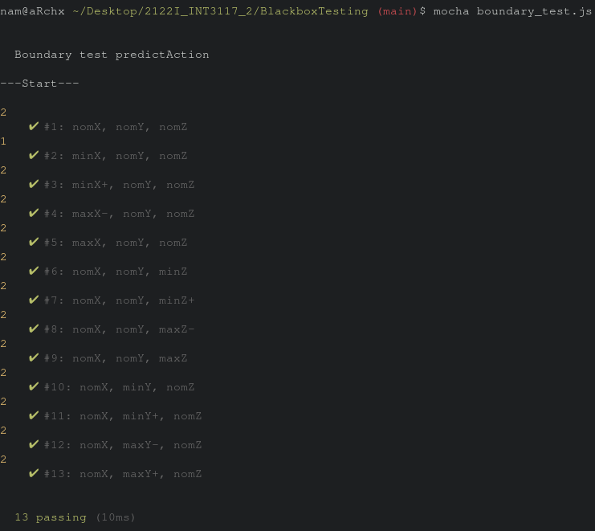
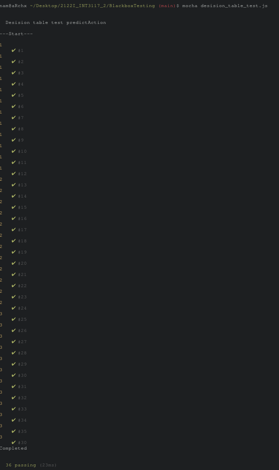

# Bài toán dự đoán hành động của bạn X

## 1. Mô tả bài toán

Xác định hành động mà người chơi đưa ra nhờ vào các thông tin được quan sát như sau:

    Nếu người chơi đạt 100 điểm trở xuống
      Trạng thái của người chơi
        - Vui
            Nếu trước 12 giờ đêm: Chơi tiếp
            Nếu sau 12 giờ đêm: Nghỉ
        - Bình thường
            Nếu trước 12 giờ đêm: Nghỉ
            Nếu sau 12 giờ đêm: Nghỉ
        - Chán
            Nếu trước 12 giờ đêm: Xóa game
            Nếu sau 12 giờ đêm: Nghỉ
    Nếu người chơi đạt từ 100 điểm đến 899 điểm
      Trạng thái của người chơi
        - Vui
            Nếu trước 12 giờ đêm: Chơi tiếp
            Nếu sau 12 giờ đêm: Chơi tiếp
        - Bình thường
            Nếu trước 12 giờ đêm: Chơi tiếp
            Nếu sau 12 giờ đêm: Nghỉ
        - Chán
            Nếu trước 12 giờ đêm: Nghỉ
            Nếu sau 12 giờ đêm: Nghỉ
    Nếu người chơi đạt từ 900 điểm đến 999
      Trạng thái của người chơi
        - Vui
            Nếu trước 12 giờ đêm: Đi đọc sách
            Nếu sau 12 giờ đêm: Nghỉ
        - Bình thường
            Nếu trước 12 giờ đêm: Nghỉ
            Nếu sau 12 giờ đêm: Nghỉ
        - Chán
            Nếu trước 12 giờ đêm: Đi xem phim
            Nếu sau 12 giờ đêm: Nghỉ
    Nếu người chơi đạt 1000 điểm
      Trạng thái của người chơi
        - Vui
            Nếu trước 12 giờ đêm: Xóa game
            Nếu sau 12 giờ đêm: Nghỉ
        - Bình thường
            Nếu trước 12 giờ đêm: Viết đánh giá game
            Nếu sau 12 giờ đêm: Nghỉ
        - Chán
            Nếu trước 12 giờ đêm: Xóa game
            Nếu sau 12 giờ đêm: Xóa game

Biết rằng game có điểm tối đa là 1000 điểm

## 2. Phân tích

Đầu vào

    Các thông tin đầu vào
    - Điểm của người chơi
    - Trạng thái của người chơi
    - Thời gian lúc người chơi hoàn thành game

Đầu ra:

    Hành động của người chơi sau khi chơi game
    - Nghỉ
    - Đi đọc sách
    - Viết đánh giá game
    - Xóa game
    - Đi xem phim
    - Chơi tiếp

Yêu cầu chức năng:

    Điểm số của người chơi
      [0, 1000] (int)
    Trạng thái của người chơi
      Vui, Bình thường, Chán (string)
    Thời điểm kết thúc game
      Trước 12 giờ đêm, sau 12 giờ đêm (boolean)

Dựa vào các thông tin của người dùng hãy phán đoán xem người chơi sẽ làm gì tiếp theo

|Điểm|Trạng thái|Thời điểm kết thúc game|Hành động|
|:-:|:-:|:-:|:-:|
|(intMin,0)|||Không có hành động phù hợp với điểm số|
|[0, 100)|Vui|Trước 12 giờ đêm|Chơi tiếp|
|[0, 100)|Vui|Sau 12 giờ đêm|Nghỉ|
|[0, 100)|Bình thường|Trước 12 giờ đêm|Nghỉ|
|[0, 100)|Bình thường|Sau 12 giờ đêm|Nghỉ|
|[0, 100)|Chán|Trước 12 giờ đêm|Xóa game|
|[0, 100)|Chán|Sau 12 giờ đêm|Nghỉ|
|[100, 899]|Vui|Trước 12 giờ đêm|Chơi tiếp|
|[100, 899]|Vui|Sau 12 giờ đêm|Chơi tiếp|
|[100, 899]|Bình thường|Trước 12 giờ đêm|Chơi tiếp|
|[100, 899]|Bình thường|Sau 12 giờ đêm|Nghỉ|
|[100, 899]|Chán| Trước 12 giờ đêm|Nghỉ|
|[100, 899]|Chán| Sau 12 giờ đêm|Nghỉ|
|[900, 999]|Vui|Trước 12 giờ đêm|Đi đọc sách|
|[900, 999]|Vui|Sau 12 giờ đêm|Nghỉ|
|[900, 999]|Bình thường|Trước 12 giờ đêm|Nghỉ|
|[900, 999]|Bình thường|Sau 12 giờ đêm|Nghỉ|
|[900, 999]|Chán|Trước 12 giờ đêm|Đi xem phim|
|[900, 999]|Chán|Sau 12 giờ đêm|Nghỉ|
|1000 |Vui|Trước 12 giờ đêm|Xóa game|
|1000|Vui|Sau 12 giờ đêm|Nghỉ|
|1000|Bình thường|Trước 12 giờ đêm|Viết đánh giá game|
|1000|Bình thường|Sau 12 giờ đêm|Nghỉ|
|1000|Chán|Trước 12 giờ đêm|Xóa game|
|1000|Chán|Sau 12 giờ đêm|Nghỉ|
|(1000, intMax)|||Không có hành động phù hợp với điểm số|


## 3. Hàm dư đoán predictAction

```javascript
const mood = {
  BORED: 1,
  STABLE: 2,
  HAPPY: 3,
};

const action = {
  DELETE_GAME: 'Delete game',
  WATCH_MOVIE: 'Watch movie',
  PLAY_AGAIN: 'Play again',
  WRITE_REVIEW: 'Write review',
  READ_BOOK: 'Read book',
  REST: 'Rest',
};

// status: number(int) in mood HAPPY, STABLE, UNHAPPY
// beforeMidnight: true/false
// point: number(int)
const predictAction = (status, beforeMidnight, point) => {
  console.log(status)
  switch(status) {
    case mood.HAPPY: {
      if (point >= 0 && point < 100) {
        return beforeMidnight ? action.PLAY_AGAIN : action.REST;
      } else if (point >= 100 && point <= 899) {
        return action.PLAY_AGAIN;
      } else if (point >= 900 && point <= 999) {
        return beforeMidnight ? action.PLAY_AGAIN : action.REST;
      } else if (point == 1000) {
        return beforeMidnight ? action.DELETE_GAME : action.REST;
      } else {
        throw new Error("Error");
      }
    }
    case mood.STABLE: {
      if (point >= 0 && point < 100) {
        return action.REST;
      } else if (point >= 100 && point <= 899) {
        return beforeMidnight ? action.PLAY_AGAIN : action.REST;
      } else if (point >= 900 && point <= 999) {
        return action.REST;
      } else if (point == 1000) {
        return beforeMidnight ? action.WRITE_REVIEW : action.REST;
      } else {
        throw new Error("Error");
      }
    }
    case mood.BORED: {
      if (point >= 0 && point < 100) {
        return beforeMidnight ? action.DELETE_GAME : action.REST;
      } else if (point >= 100 && point <= 899) {
        return action.REST;
      } else if (point >= 900 && point <= 999) {
        return beforeMidnight ? action.WATCH_MOVIE : action.REST;
      } else if (point == 1000) {
        return beforeMidnight ? action.DELETE_GAME : action.REST;
      } else {
        throw new Error("Error")
      }
    }
    default: {
      throw new Error("Error");
    }
  }
}

module.exports = {
  predictAction,
  action,
  mood,
};
```

## 4. Dùng 2 kĩ thuật kiểm thử hộp đen

Trạng thái của người chơi
- Vui: 3
- Bình thường: 2
- Chán: 1

Thời điểm kết thúc game trước 12 giờ đêm:
- False: 0
- True: 1

Điểm của người chơi
- (intMin,0)
- [0, 100)
- [100, 899]
- [900, 999]
- 1000
- (1000, intMax)

Kết quả sau khi chơi xong
- Chơi tiếp
- Nghỉ
- Xóa game
- Đi đọc sách
- Đi xem phim
- Viết đánh giá game

### A. Kiểm thử giá trị biên
_Giá trị True/False sẽ được xét về dạng 1/0. Giá trị trung bình sẽ được sử dụng hàm Math.round() của JS để có kết quả_

|Giá trị|Trạng thái của người chơi (x)|Trước 12 giờ đêm (y)|Điểm của người chơi (z)|
|:-:|:-:|:-:|:-:|
|min|1|False|0|
|min+|2|False|1|
|nom|2|**Math.round(0.5) == True**|500|
|max-|2|True|999|
|max|3|True|1000|

_Tổng số ca kiểm thử theo công thức: 4 * 3 + 1 = 13_

|#|x|y|z|Giá trị x|Giá trị y|Giá trị z|Kết quả mong đợi|Kết quả thực tế|
|:-:|:-:|:-:|:-:|:-:|:-:|:-:|:-:|:-:|
|1|nomX|nomY|nomZ|2|True|500|Play again|Play again|
|2|minX|nomY|nomZ|1|True|500|Rest|Rest|
|3|minX+|nomY|nomZ|2|True|500|Play again|Play again|
|4|maxX-|nomY|nomZ|2|True|500|Play again|Play again|
|5|maxX|nomY|nomZ|3|True|500|Play again|Play again|
|6|nomX|nomY|minZ|2|True|0|Rest|Rest|
|7|nomX|nomY|minZ+|2|True|1|Rest|Rest|
|8|nomX|nomY|maxZ-|2|True|999|Rest|Rest|
|9|nomX|nomY|maxZ|2|True|1000|Write review|Write review|
|10|nomX|minY|nomZ|2|False|500|Rest|Rest|
|11|nomX|minY+|nomZ|2|False|500|Rest|Rest|
|12|nomX|maxY-|nomZ|2|True|500|Play again|Play again|
|13|nomX|maxY|nomZ|2|True|500|Play again|Play again|

Kết quả kiểm thử



### B. Kiểm thử lớp tương đương

|Test|Status(x)|BeforeMidnight(y)|Point(z)|Expected output|
|:-:|:-:|:-:|:-:|:-:|
|1|1|False|(intMin,0)|Error|
|2|1|False|[0, 100)|Rest|
|3|1|False|[100, 899]|Rest|
|4|1|False|[900, 999]|Rest|
|5|1|False|1000|Rest|
|6|1|False|(1000, intMax)|Error|
|7|1|True|(intMin,0)|Error|
|8|1|True|[0, 100)|Delete game|
|9|1|True|[100, 899]|Rest|
|10|1|True|[900, 999]|Watch movie|
|11|1|True|1000|Delete game|
|12|1|True|(1000, intMax)|Error|
|13|2|False|(intMin,0)|Error|
|14|2|False|[0, 100)|Rest|
|15|2|False|[100, 899]|Rest|
|16|2|False|[900, 999]|Rest|
|17|2|False|1000|Rest|
|18|2|False|(1000, intMax)|Error|
|19|2|True|(intMin,0)|Error|
|20|2|True|[0, 100)|Rest|
|21|2|True|[100, 899]|Play again|
|22|2|True|[900, 999]|Rest|
|23|2|True|1000|Write review|
|24|2|True|(1000, intMax)|Error|
|25|3|False|(intMin,0)|Error|
|26|3|False|[0, 100)|Rest|
|27|3|False|[100, 899]|Play again|
|28|3|False|[900, 999]|Rest|
|29|3|False|1000|Rest|
|30|3|False|(1000, intMax)|Error|
|31|3|True|(intMin,0)|Error|
|32|3|True|[0, 100)|Play again|
|33|3|True|[100, 899]|Play again|
|34|3|True|[900, 999]|Read book|
|35|3|True|1000|Delete game|
|36|3|True|(1000, intMax)|Error|

### C. Kiểm thử sử dụng bảng quyết định

####

|Điều kiện|1|2|3|4|5|6|7|8|9|10|11|12|13|14|15|16|17|18|19|20|21|22|23|24|
|:-:|:-:|:-:|:-:|:-:|:-:|:-:|:-:|:-:|:-:|:-:|:-:|:-:|:-:|:-:|:-:|:-:|:-:|:-:|:-:|:-:|:-:|:-:|:-:|:-:|
|x == 1|T|T|T|T|T|T|T|T
|x == 2|||||||||T|T|T|T|T|T|T|T
|x == 3|||||||||||||||||T|T|T|T|T|T|T|T|
|y == true|T|T|T|T|||||T|T|T|T|||||T|T|T|T|
|y == false|||||T|T|T|T|||||T|T|T|T|||||T|T|T|T|
|z >= 0 && z < 100|T|||T|||||T||||T||||T||||T||||
|z >= 100 && z <= 899||T|||T|||||T||||T||||T||||T|||
|z >= 900 && z <= 999|||T|||T|||||T||||T||||T||||T|
|z == 1000||||T|||T|||||T||||T||||T||||T
|Kết quả|-|-|-|-|-|-|-|-|-|-|-|-|-|-|-|-|-|-|-|-|-|-|-|-|
|Play again||||||||||T|||||||T|T||||T
|Rest||T|||T|T|T|T|T||T||T|T|T|T|||||T||T|T|
|Delete Game|T|||T||||||||||||||||T|||||
|Write review||||||||||||T
|Read book|||||||||||||||||||T
|Watch movie|||T|


#### 12 Trường hợp lỗi
|Điều kiện|1|2|3|4|5|6|7|8|9|10|11|12|
|:-:|:-:|:-:|:-:|:-:|:-:|:-:|:-:|:-:|:-:|:-:|:-:|:-:|
|x == 1|T|T|||||T|T
|x == 2|||T|T|||||T|T|
|x == 3|||||T|T|||||T|T|
|y == true|T||T||T||T||T||T|
|y == false||T||T||T||T||T||
|z < 0|T|T|T|T|T|T
|z > 1000|||||||T|T|T|T|T|T|
|Kết quả|-|-|-|-|-|-|-|-|-|-|-|-|
|**Error**|T|T|T|T|T|T|T|T|T|T|T|T|T

### Tạo các test case

|Test|Status(x)|BeforeMidnight(y)|Point(z)|Expected output|Output|
|:-:|:-:|:-:|:-:|:-:|:-:|
|1|1|False|-10|Error|Error|
|2|1|False|50|Rest|Rest|
|3|1|False|420|Rest|Rest|
|4|1|False|997|Rest|Rest|
|5|1|False|1000|Rest|Rest|
|6|1|False|2000|Error|Error|
|7|1|True|-100|Error|Error|
|8|1|True|27|Delete game|Delete game|
|9|1|True|270|Rest|Rest|
|10|1|True|927|Watch movie|Watch movie|
|11|1|True|1000|Delete game|Delete game|
|12|1|True|1001|Error|Error|
|13|2|False|-1|Error|Error|
|14|2|False|48|Rest|Rest|
|15|2|False|280|Rest|Rest|
|16|2|False|969|Rest|Rest|
|17|2|False|1000|Rest|Rest|
|18|2|False|3002|Error|Error|
|19|2|True|-999999|Error|Error|
|20|2|True|2|Rest|Rest|
|21|2|True|200|Play again|Play again|
|22|2|True|999|Rest|Rest|
|23|2|True|1000|Write review|Write review|
|24|2|True|6000|Error|Error|
|25|3|False|-25|Error|Error|
|26|3|False|25|Rest|Rest|
|27|3|False|250|Play again|Play again|
|28|3|False|925|Rest|Rest|
|29|3|False|1000|Rest|Rest|
|30|3|False|20001|Error|Error|
|31|3|True|-69|Error|Error|
|32|3|True|69|Play again|Play again|
|33|3|True|693|Play again|Play again|
|34|3|True|926|Read book|Read book|
|35|3|True|1000|Delete game|Delete game|
|36|3|True|2002|Error|Error|

Kết quả




### Hướng dẫn chạy

#### Yêu cầu:
```
NodeJS
npm
```

#### Cài đặt

```bash
# 2122I_INT3117_2/BlackboxTesting
npm install
```

#### Chạy

Kiểm thử biên mạnh

```bash
# 2122I_INT3117_2/BlackboxTesting
npm run boundary-test
```

Kiểm thử dùng bảng quyết định
```bash
# 2122I_INT3117_2/BlackboxTesting
npm run decision-table-test
```
