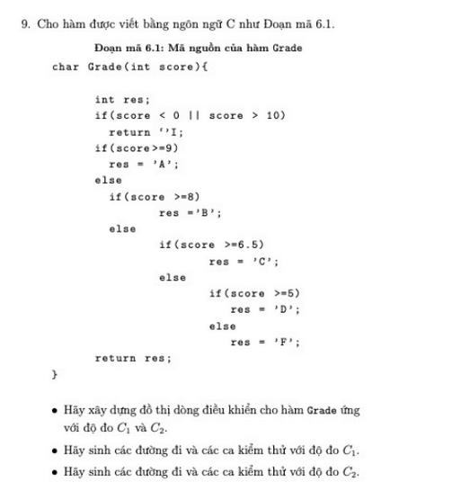
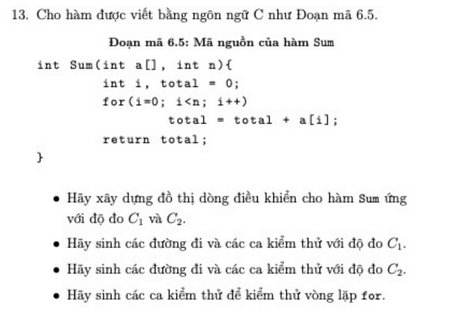
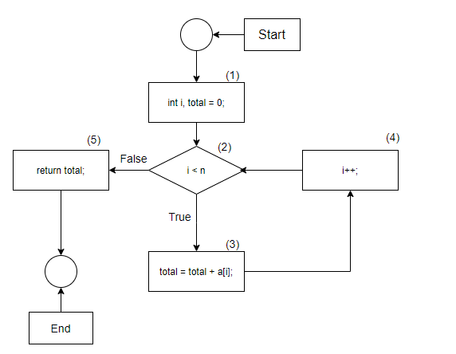
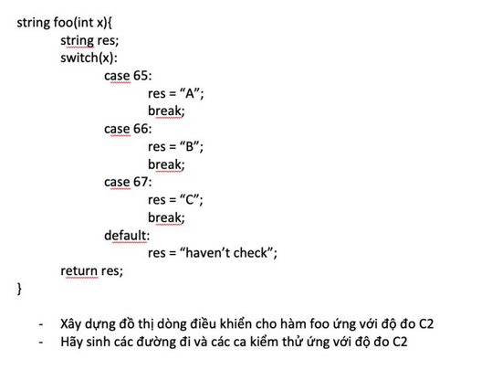
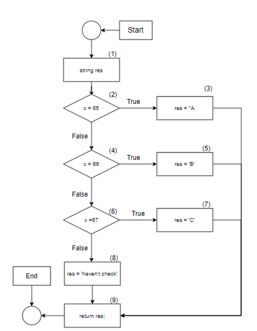

# Bài tập kiểm thử luồng điều khiển

## Bài 1:

Đề bài:

Bài giải:

a. Sơ đồ

b. Sinh đường đi và các ca kiểm thử với độ đo C1

|Đường đi|Ca kiểm thử|Đầu ra|
|-|-|-|
|1 - 2(T) - 3|Grade(-1)|I
|1 - 2(F) - 4(T) - 5 - 13|G(9)|A
|1 - 2(F) - 4(F) - 6(T) - 7 - 13|G(8)|B
|1 - 2(F) - 4(F) - 6(F) - 8(T) - 9 - 13|G(7)|C
|1 - 2(F) - 4(F) - 6(F) - 8(F) - 10(T) - 11 - 13|G(6)|D
|1 - 2(F) - 4(F) - 6(F) - 8(F) - 10(F) - 12 - 13|G(2)|F

c. Sinh đường đi và các ca kiểm thử với độ đo C2

|Đường đi|Ca kiểm thử|Đầu ra|
|-|-|-|
|1 - 2(T) - 3|Grade(-1)|I
|1 - 2(F) - 4(T) - 5 - 13|G(9)|A
|1 - 2(F) - 4(F) - 6(T) - 7 - 13|G(8)|B
|1 - 2(F) - 4(F) - 6(F) - 8(T) - 9 - 13|G(7)|C
|1 - 2(F) - 4(F) - 6(F) - 8(F) - 10(T) - 11 - 13|G(6)|D
|1 - 2(F) - 4(F) - 6(F) - 8(F) - 10(F) - 12 - 13|G(2)|F

## Bài 2:

Đề bài:

Bài làm:

a.

b. Sinh đường đi và các ca kiểm thử với độ đo C1

Đường đi:

    1 - 2(T) - 3 - 4 - 2(F) - 5
Ca kiểm thử:

    Input : n = 1,a[] = [1]
    Output: 1
    Expected Output : 1

c. Sinh đường đi và các ca kiểm thử với độ đo C2

Đường đi:

    1 - 2(T) - 3 - 4 - 2(F) - 5
Ca kiểm thử:

    Input : n = 2,a[] = [1, 2]
    Output: 3
    Expected Output : 3

d. Kiểm thử vòng lặp for

|Số lần lặp|Input|Output|Expected Output|
|-|-|-|-|
|0|n=0, a[] = []|0|0
|1|n=1, a[] = [1]|1|1
|2|n=2, a[] = [1, 2]|3|3

## Bài 3:

Đề bài:

Bài làm:

a.

b.

|Đường đi|Input|Output|Expected Output|
|-|-|-|-|
|1,2(T),3,9|65|A|A
|1,2(F),4(T),5,9|66|B|B
|1,2(F),4(F),6(T),7,9|67|C|C
